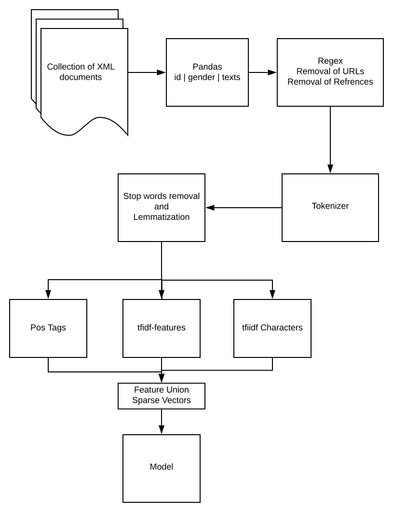
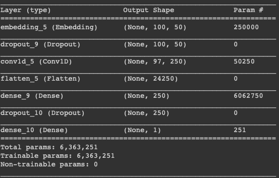

# Author Profiling using of Twitter Data 

### What is Author Profiling?

" Author profiling is the analysis of a given set of texts in an attempt to uncover various characteristics of the author based on stylistic- and content-based features. Characteristics analysed commonly include age and gender, though more recent studies have looked at other characteristics like personality traits and occupation "

\- [Wikipedia](https://en.wikipedia.org/wiki/Author_profiling "Author Profiling")

## Motivation
---

This project is an extension on Author Profiling to tell the persons gender therefore this project relies on two levels of polarity Male and Female.

Though the modles out here are made for the afermentioned levels of polarity we can further extend* this for other charestics as well as it follows a genralised way of solving this NLP based classification

## Pre-processing 
___

### Preprocessing for CNN and LSTM

The model initially takes the texts in the embedding format by first tokenizing the each word and then running through a function called text_to_sequence () which these words and then finally adding the padding to words as for Deep learning models has to be of the same input size and the tweets are of variable sizes. The function truncates sentences which are bigger than the limit that we set and also adds padding to sentences smaller to that of the limit to generate the same input length. In our case the limit is set to 150 the same as that of the twitter’s maximum limitation.

### Preprocessing for classical model

| Processing Step        | Use   | 
| ------------- |:-------------:| 
| Urls | Removed all URLs using regular expression|  
| @mentions | Removed user mentions from tweet|    
| #hastag | Splitting combined word to 2 if in hashtag|    
| Lematization | Lematized certain words|    
| Truncating Expressions | Words were truncated like ahhhhh to ah|    
| Lowering | Lower casing the words| 
| Unique Words | Unique words were removed|
| Small words | Small words were removed|  

## Feature Genration:
---
### Features and Architecture CNN

In the case of the model one there is limited explicit feature generation that has been done one of the key feature generation was that of mapping the words to the glove embeddings. Other on that N-gram is inherently given weightage depending on the size of the convolution kernel (N x Dims; where N is the size of kernel and Dims is the dimensions that are generated during the embedding phase for each word)

### Feature Genration:

After Pre-processing the data, certain features from the data are extracted to build the model. Different models use different features for building the model. Supervised learning models SVC, SGD used features mentioned below:
We have extracted the following features from the tweet:
1. Unigrams, Bigrams, Trigrams, and Fourgrams from the words.
2. Bigrams, Trigrams, Fourgrams from the characters
3. Unigram, Bigram, Fourgram from the Parts of Speech Tags.
4. The words and chars which are occurring in all the documents are removed
5. Stop words from Words and Chars are removed
6. All the N grams are than converted to TF Vectors.
7. All the N grams except Parts of Speech are converted to IDF Vector

__Benefit of using these features:__ The above features were helpful in creating a sparse vector of all the individual words in the matrix hence, the computation time and memory reduced significantly.
  4

TFIDF provided probability of each word which was helpful in getting better accuracy of the model.
1. TF(w) = (Number of times term w appears in a document) / (Total number of terms in the document)
2. IDF(w) = log_e(Total number of documents / Number of documents with term w in it)

## Experiment Setup:
---

| Models        | Development Environement| Hyper Parameters  |
| ------------- |:-------------:| -----:|
| CNN + Glove   | Google Colab | The Model Structure (Inclusion of more layers like Conv1d,Maxpooling etc.) Learning Rate Batch sizeFilters (for the Conv1d layer) Kernel Size Parameter size Number of Dimensions of word - - Vectors |
| SVC Linear Classifier     | Personal Computer     |   C = 5.0,Kernel = Linear Random state = 0 Penalty = l2 Dual = True |
| SGD Classifier | Amazon EC2 C5x18 Large|    Random state = 0 Loss = hinge Penalty = l2 |

## Result:
---
| Features        | CNN           | SVC  | SGD|
| ------------- |:-------------:| -----:|:---:|
| Accuracy  | 51% | 84% | 86% |
| Hyper Parameter Tuning    | Learning Rate = 0.1,Batch size = 32,Filters (for the Conv1d layer) = 250 Kernel Size = 4, Parameter size = Default, Number of Dimensions of word vectors = 50     |   C = 5.0, Kernel = Linear Random state = 0 Penalty = l2, Dual = True|Random state = 0 Loss = hinge Penalty = l2|
| Data Used | Word Embeddings (Normal word embedding and glove)|    TF-IDF for words, chars and POS |TF-IDF for words, chars and POS|